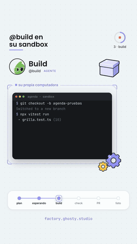

# fabrica-reel: un pedido cruza la fábrica

<p align="center">
  
</p>

<p align="center">
  <em>Ghosty Factory, vertical 1080×1920, 70 s, con narración. Un pedido real cruza el tablero de #fabrica.<br>
  <a href="docs/fabrica-reel.mp4">Ver con audio</a></em>
</p>

Es la segunda producción con [partitura-reel](../partitura-reel) y la primera con narración. **La voz marca
el tiempo:** cada escena dura lo que su frase más un respiro, y cada efecto se ancla a la palabra que lo
nombra. El sello cae justo después de «apruebas», las pruebas pasan a verde en «hasta que pasan», y así en todas.

## La historia

Lo que se dibuja es el producto real, estilizado; no hay metáforas. La tarjeta del **pedido #2** (24 sep 2026, PR #34)
cruza las seis columnas reales del tablero: `plan → esperando aprobación → build → check → PR → listo`.
En cada columna la cámara entra a lo que de verdad pasa ahí:

1. @plan lee el repo con la lupa y escribe el plan (historia, brief técnico, riesgos).
2. Tú apruebas: la mano aprieta «Aprobar» y luego baja el sello.
3. @build trabaja en su sandbox: la caja se cierra, los engranes giran y la terminal corre vitest (10 passed).
4. @check une cada punto del plan con el diff, sin editar nada; el CI sale 4 de 4 y «0 vueltas».
5. Llega el PR #34 con su preview; tú aprietas «Mezclar» y cae el confeti.
6. La tarjeta llega a «listo»: 7 min de tu firma al PR revisado. Cierra con el CTA a factory.ghosty.studio.

Abajo, un riel con las seis etapas muestra en todo momento dónde va el pedido.
Todo va en el estilo oficial de ghosty.studio: blanco, tarjetas redondeadas, sombra suave, lila y avatares de la marca.

## Cómo corre

```sh
./gen-voice.py                                     # frases (em_santa) + tiempos de palabra (whisper) → voice/lines.json
node score.mjs                                     # escenas y efectos anclados a la voz → score.gen.js / .json
python3 synth.py bed.wav bed                       # cama: acordes, bombo suave, melodía discreta (se agacha con la voz)
python3 synth.py sfx.wav sfx                       # efectos: uno por momento (no se agachan)
npx hyperframes@0.8.44 render . --experimental-fast-capture=false --low-memory-mode -o renders/mudo.mp4
./mix.sh                                           # voz −15 · cama −26 con sidechain · efectos −19 · falla si el video no mide lo de la partitura
```

| Archivo | Qué hace |
| --- | --- |
| `voice/lines.json` | Las 10 frases, escritas como se pronuncian, con duración y tiempos de palabra |
| `score.mjs` | Escenas, momentos visuales (`T`), efectos (`sfx`), cama (`bed`, `pads`) y voz |
| `index.html` | La composición: DOM con el estilo de la marca y GSAP; lee `window.SCORE` |
| `synth.py` | Instrumentos en numpy: `pop`, `knock` (sello), `marimba`, `pluck`, `click`, `sweep`, `confetti` y `bell` (sólo el logo) |
| `atlas/` | Hoja de 12 sprites en el estilo de la marca (gpt-image-2, `low`, ~1 centavo) y sus recortes |
| `styleframes/` | Los tres cuadros que se aprobaron antes de animar |

## Lo que aprendimos (y cómo lo pagamos)

Nos equivocamos mucho en el camino. Estas reglas salieron de esos errores.

### Historia y dirección
- **Se dibuja la cosa real, no una metáfora.** La versión anterior (el repo como enredadera, el esqueje bajo una campana, el injerto) se rechazó completa porque la metáfora no se entendía y la campana vacía se leía como «esto reemplaza a algo». El explainer que tomamos de referencia dibuja el DOM, las capas y la IP tal cual.
- **Primero se aprueban los tres renglones de storytelling y el guion, luego los style frames, y al final se renderiza.** Arrancar sin aprobación costó una producción entera.
- **El vertical se diseña nativo.** Escalar el 16:9 deja medio cuadro vacío.
- **Una pieza de Ghosty va con el estilo oficial de la marca.** El neobrutalismo y las pieles de la referencia chocan con la marca, y Brenda lo notó.
- **Los fondos pertenecen al tema.** Aquí el fondo es el propio tablero; las rayas genéricas se sintieron vacías.

### Sonido
- **Pocas notas.** Una nota por archivo, por prueba y por palomita satura. Funciona mejor una cama con melodía propia y unos 15 acentos en momentos clave.
- **Cada sonido va con un cambio visible en el mismo cuadro.** Un acorde sin nada que se mueva, o un arpegio de 0.3 s sobre una pantalla quieta, se siente fuera de lugar. Lo verificamos cuadro por cuadro.
- **El viento sólo suena en las cortinillas.** Repetido en cada salto de columna cansa. Los aterrizajes llevan un «toc» de marimba.
- **Sin abusar de la campana.** Aparecer usa un pop seco, el sello un golpe de madera, el conteo de «7 min» un rasgueo de cuerda. La campana quedó sólo para el brillo del logo final.
- **Los silencios no se cortan en seco.** En las esperas de firma, la cama baja a un acorde suspendido y resuelve con el clic; un corte total se sentía como error.
- **Dos acciones seguidas suenan en orden.** El clic de «Aprobar» y el sello iban juntos; ahora el sello cae 0.75 s después, cuando la mano ya se fue.
- **Los efectos que caen sobre la voz se suben.** Se miden contra la voz con las pistas separadas (voz, cama y efectos), no sobre la mezcla, porque la mezcla engaña.
- **Los golpes graves desaparecen en el celular.** El sello a 70 Hz no se oía; le dimos un «toc» a 180–410 Hz y un chasquido entre 1 y 3 kHz.

### Imagen y movimiento
- **Nada de zoom justo antes de la cortinilla.** Entrar a la tarjeta y que luego la cortinilla se llevara el tablero se sentía feo. Ahora la tarjeta brilla y se levanta, y la cortinilla hace el cambio.
- **La mano va encima de todo** (también del riel), entra sólo cuando va a apretar y sale completa del cuadro.
- **El confeti termina de caer antes del corte.** La escena del veredicto se alargó para eso.
- **Si la tarjeta baja de columna, que no brinque en arco.** Se levanta, viaja recta y se asienta.
- **Sprites:** lo rígido (girar, bajar, recorrer) se anima con código y queda suave; sólo lo que cambia de forma usa cuadros. En la hoja de sprites cada cuadro es otro dibujo, así que animar lo rígido por cuadros se ve a golpes.

### Trampas del pipeline
- **El render falló por falta de disco y el montaje usó en silencio el video viejo.** Para 67 s, la captura a disco pide unos 16 GB. Ahora se renderiza con `--low-memory-mode` y `mix.sh` **falla** si la duración del video no coincide con la partitura.
- **Una edición metió el sonido del sello dentro de un comentario** y nunca sonó. Revisar `score.gen.json` (lo que de verdad se va a tocar), no el código.
- **El compilador de HyperFrames rompe un `<script>` con etiquetas HTML literales en strings.** El render sale en blanco aunque el snapshot se vea bien. Escribir `<`.
- **La captura rápida (drawElement) se comió un elemento con opacidad.** Usar `--experimental-fast-capture=false`.
- **Kokoro se come el arranque de «arroba bild»** cuando la frase abre con esa palabra (whisper oyó «Robaville»). Anteponer «Luego,» lo resolvió.

## No versionado

`voice/*.wav`, `score.gen.*`, `bed.wav`, `sfx.wav` y `renders/` se regeneran con los comandos de arriba. Los SVG
de `assets/` son los oficiales de ghosty.studio; los PNG son los recortes del atlas.
