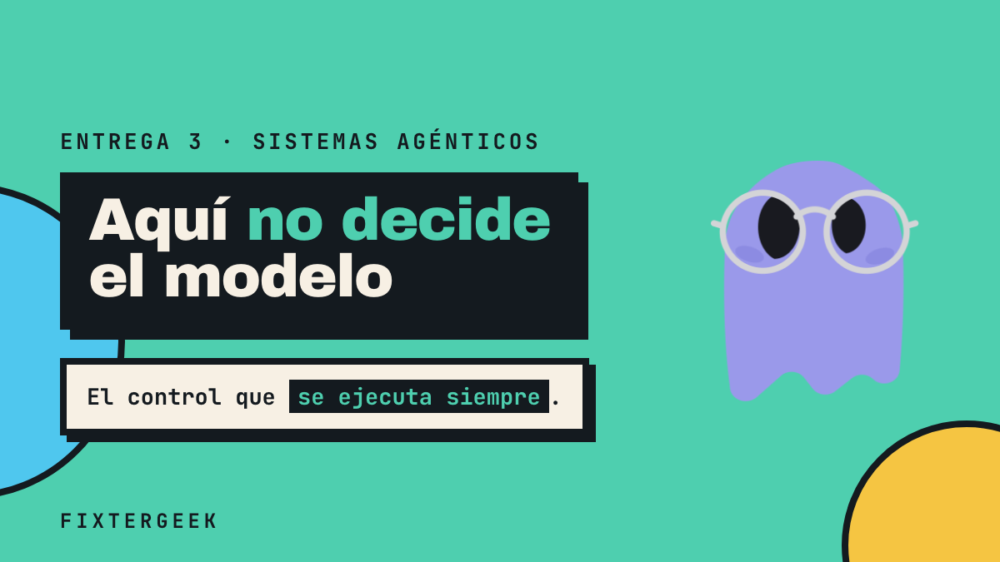

# hooks-reel — 9:16, 2:10, HTML + GSAP

Video de la entrega 3 de la secuencia de preparación del taller de sistemas
agénticos: **el hook es el lugar del ciclo, el guardrail es la regla que
escribes dentro**.

<p align="center">
  
</p>

A diferencia del resto del repo, aquí **no hay Blender**. La composición es un
documento HTML: el DOM declara el tiempo con atributos `data-*` y GSAP anima
sobre una línea de tiempo pausada que el renderer va buscando cuadro por cuadro.
Es 2D plano, así que no hace falta cámara, materiales ni luz — y renderiza 3300
cuadros en menos de un minuto.

## Cómo está armado

```
index.html                 el host: 130s, las tres escenas, la voz y la música
compositions/
  bg-field.html            papel de color plano que cambia en cada corte
  s1-la-apuesta.html       el problema — Ghosty duda, se marea y se pone emo
  s2-la-compuerta.html     el mecanismo — la compuerta PreToolUse
  s3-la-primitiva.html     tres snippets: Claude Code, LangGraph, OpenAI
  wipes.html               transiciones: tres barras que barren el corte
styleframes/               diapositivas de estilo estáticas (se aprueban antes de animar)
frame.md                   LA DIRECCIÓN DE ARTE — leer esto primero
SCRIPT.md                  guion de narración, con los anglicismos ya fonéticos
STORYBOARD.md              plan de escenas y tiempos
```

## Replicarlo

```bash
npm i -g hyperframes            # o npx hyperframes@latest
npx hyperframes check           # lint + layout + motion + contraste
npx hyperframes snapshot --at 18,50,100   # PNGs para revisar sin renderizar
npx hyperframes render          # MP4
```

Antes de que corra necesitas generar lo que no está en el repo (ver abajo):

```bash
# Voz: Kokoro local. Sin esto no hay narración ni tiempos.
export HYPERFRAMES_PYTHON=~/.venvs/kokoro/bin/python   # necesita kokoro-onnx
npx hyperframes tts --voice em_santa --speed 0.92 --lang es \
  -o assets/voice/s1-la-apuesta.wav escena1.txt
```

## Lo que NO está en el repo, y por qué

- **`assets/voice/*.wav`** — se regeneran desde `SCRIPT.md` con Kokoro. Ojo:
  los anglicismos van escritos fonéticos (`juk`, `járnes`, `gardréil`), porque
  el sintetizador los mastica si se escriben en inglés.
- **`assets/bgm-*.mp3`** — la licencia de Mixkit permite uso comercial pero
  **prohíbe redistribuir las pistas por separado**. `assets/BGM.md` trae la URL
  exacta, el punto de corte y el volumen de cada una.
- **`renders/` y `snapshots/`** — salida reproducible.

## Las tres cosas que cuesta descubrir solo

**1. Sincronizar con timestamps medidos, nunca estimados.**

```bash
npx hyperframes transcribe assets/voice/s1.wav --language es --model medium --json
```

Deja `transcript.json` con la posición de cada palabra. Repartir la duración
contando caracteres falla, y `silencedetect` falla peor: marca las pausas de
respiración *dentro* de las frases, no los límites entre ellas. Por ahí los
gestos de Ghosty quedaron 3.3 segundos tarde. Los ítems de una enumeración
hablada duran ~1s cada uno.

**2. El personaje se anima encima, nunca se repinta.** Ghosty es un PNG oficial
(`https://formmy.app/logo.png` — las copias locales tienen la falda deformada).
Los estados de ánimo son grupos `<svg>` sobre él, prendidos con `opacity`: boca
torcida, remolinos de mareo, fleco emo. Borrar un estado es borrar un grupo.

**3. Las rutas de asset van desde la raíz del proyecto**, no desde
`compositions/`. Un `../assets/x.png` pasa el render pero da 404 en el preview.

## El sistema visual

Está escrito completo en [`frame.md`](./frame.md): caricatura plana, colores
sólidos, **cero gradientes y cero blur**, sombra dura sin difuminar, contorno de
tinta. El texto nunca flota sobre el fondo — siempre dentro de un bloque sólido,
porque las formas del campo pasan por detrás y lo vuelven ilegible.

Motion de caricatura: `back.out(1.7)`, squash & stretch, pops discretos. La
única figura del video que **no** se deforma es la compuerta: su rigidez es el
argumento de la escena.

## Cuándo usar esto y cuándo Blender

| | HTML + GSAP (aquí) | Blender (el resto del repo) |
| --- | --- | --- |
| Tipografía, diagramas, código en pantalla | ✅ | caro |
| Profundidad, cámara, materiales | ✗ | ✅ |
| Capturar una UI real en capas | ✗ | ✅ |
| Iterar el diseño | segundos | minutos |
| Render de 2 min en 9:16 | ~50s | mucho más |

Si lo que cuentas cabe en un plano, esto es más rápido. Si algo tiene que salir
de la pantalla o girar en el espacio, Blender.
