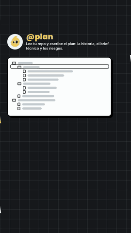

# partitura-reel — la partitura mueve la imagen y el sonido

<p align="center">
  
</p>

<p align="center">
  <em>Ghosty Factory, 9:16, 37 s. Cada cosa que aparece en pantalla toca su nota en el mismo cuadro.<br>
  <a href="docs/partitura-reel.mp4">Ver con audio</a></em>
</p>

**Desde el 24 sep 2026 los reels se hacen así.** En [harness-reel](../harness-reel) y
[hooks-reel](../hooks-reel) la voz fijaba los tiempos y la música era una cama por debajo. Aquí
manda una partitura: `score.mjs` escribe cada evento en tiempos musicales, y de ese mismo archivo
salen la línea de tiempo de GSAP y las notas del sintetizador. Así la imagen y el sonido no pueden
desfasarse, porque los dos leen el mismo reloj.

## De dónde salió

La técnica viene de un explainer de «how browsers work» hecho con Claude Opus 5.5. Lo medimos cuadro por cuadro:

- Las notas caen en una rejilla de dieciseisavos a 120 BPM: el 89 % a menos de 15 ms y el error medio es de 6 ms.
- Cada nodo del DOM aparece en el mismo cuadro que su nota: `<html>` 10.27/10.24 s, `<head>` 10.50/10.49 s, `<title>` 10.63/10.61 s…
- Todo el audio es sintetizado: bombo senoidal con barrido de tono, acordes con trémolo, campanas y barridos de ruido.

## Cómo corre

```sh
npm run score          # score.mjs → score.gen.js (imagen) + score.gen.json (sonido)
python3 synth.py       # score.gen.json → music.wav (numpy, 48 kHz, sin modelos ni catálogo)
./gen-voice.sh         # voz del CTA con em_santa (Kokoro, local)
npm run render         # HyperFrames → renders/mudo.mp4 (con --experimental-fast-capture=false)
./mix.sh               # mezcla + verificación sobre el archivo entregado
python3 verif-sync.py renders/factory-partitura.mp4
```

| Archivo | Qué hace |
| --- | --- |
| `score.mjs` | Escenas (duración en dieciseisavos, piel, glifo de la cortinilla), eventos `{t, id, inst, note}`, acordes y silencios |
| `index.html` | Composición 1080×1920. Cada `id` de evento se vuelve un tween en su tiempo exacto; las escenas y cortinillas salen de `SCORE.scenes` |
| `synth.py` | Un instrumento por rol, tocado evento por evento |
| `mix.sh` | Voz a −15 LUFS; la partitura se agacha con `sidechaincompress` (llave: la voz). Ganancia fija + `alimiter`; verifica `start_time`, `blackdetect`, SAR, LUFS y el RMS de los silencios |
| `verif-sync.py` | Cuantiza los ataques del MP4 final a la rejilla y revisa que cada evento visual cambie la imagen en su cuadro |

## Resultado medido (sobre el MP4 entregado)

- El audio va desfasado 5 ms respecto a la partitura (medido por correlación cruzada).
- El 91 % de las notas cae a menos de 15 ms de la rejilla (sin contar la voz, que no va a tiempo).
- 71 de 72 apariciones cambian la imagen en su cuadro. La que falta es un commit que en su primer cuadro todavía es un punto.
- Los silencios de las firmas humanas bajan a −91 dB y −37 dB.

## Experimentar con sonidos

Los instrumentos son funciones cortas en `synth.py`, cada una con la firma `(nota MIDI, duración, velocidad) → señal`:

| Instrumento | Rol | Cómo suena |
| --- | --- | --- |
| `bell` | @plan | FM: portadora senoidal y moduladora a 3.5× que se apaga en 0.25 s |
| `marimba` | @build | Senoidal + parcial 4× muy corto |
| `pluck` | @check | Karplus-Strong |
| `pad` | Ghosty / cama | Sierras desafinadas ±8 cents, pasabajas y trémolo en octavos |
| `kick`, `hat`, `click`, `sweep`, `stamp`, `confetti` | ritmo y efectos | Barrido 150→45 Hz, ruido filtrado, arpegio en fusas |

Para probar otro sonido:
1. Escribe la función en `synth.py`.
2. Agrégala al `if/elif` de «tocar».
3. Pon su nombre en el `inst` del evento en `score.mjs`.

No hace falta tocar la animación. Para cambiar la escala, la progresión o el tempo, se editan
`PENTA`, `CHORDS` y `S16` en `score.mjs`, y todo se realinea solo.

## Reglas que costaron

- **Las escenas se ocultan con `display`, no con `visibility`.** Un hijo con `visibility: visible` se ve aunque el padre esté oculto, y las escenas viejas se transparentaban.
- **La captura rápida de HyperFrames (drawElement) se comió un chip con opacidad.** Hay que renderizar con `--experimental-fast-capture=false` y revisar el cuadro.
- **Cada escena termina quieta ~1 s antes de la cortinilla.** Si la cortinilla entra justo cuando se completa la pantalla, no da tiempo de apreciarla. Por eso cada escena mide lo suyo en dieciseisavos y no un compás fijo.
- **Los silencios se escriben en la partitura; no son fades.** Aquí son las dos aprobaciones humanas (firmar el plan y «Mezclar»): la música se corta y vuelve con el sello.
- **El confeti va a mano:** estallido rápido hacia arriba (`power2.out`) y caída después. Con una sola curva `power1.in` casi no se mueve antes de la cortinilla.

## No versionado

`music.wav`, `voice/`, `score.gen.*` y `renders/` se regeneran con los comandos de arriba. Los SVG
de `assets/` son los oficiales de ghosty.studio.
